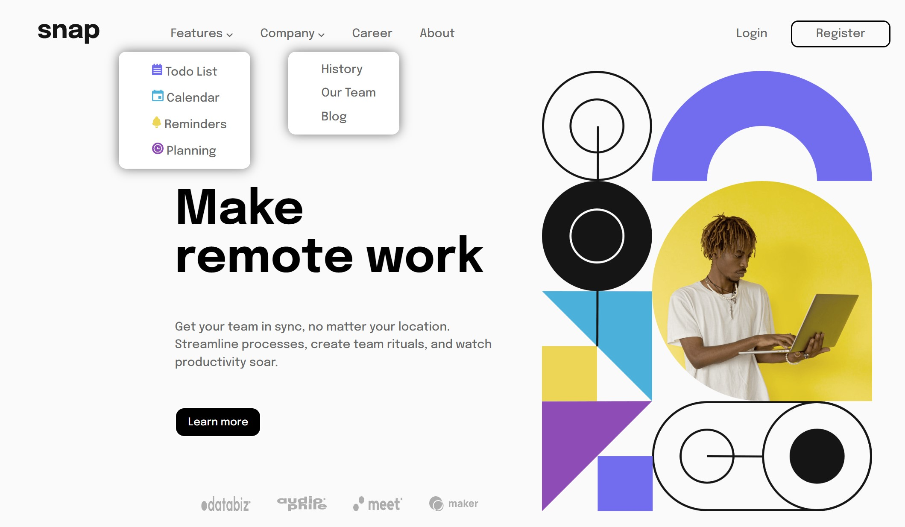

# Frontend Mentor - Intro section with dropdown navigation solution

This is a solution to the [Intro section with dropdown navigation challenge on Frontend Mentor](https://www.frontendmentor.io/challenges/intro-section-with-dropdown-navigation-ryaPetHE5). Frontend Mentor challenges help you improve your coding skills by building realistic projects. 

## Table of contents

- [Overview](#overview)
  - [The challenge](#the-challenge)
  - [Screenshot](#screenshot)
  - [Links](#links)
- [My process](#my-process)
  - [Built with](#built-with)
  - [What I learned](#what-i-learned)
  - [Useful resources](#useful-resources)
- [Author](#author)

## Overview

### The challenge

- View the relevant dropdown menus on desktop and mobile when interacting with the navigation links
- View the optimal layout for the content depending on their device's screen size
- See hover states for all interactive elements on the page

### Screenshot



### Links

- Solution URL: [Add solution URL here](https://github.com/XshubhamG/Intro-section-with-Dropdown.git)
- Live Site URL: [Add live site URL here](https://golden-sunshine-974b7f.netlify.app)

## My process

### Built with

- Semantic HTML5 markup
- CSS custom properties
- Flexbox
- CSS Grid
- Mobile-first workflow
- JavaScript

### What I learned

Use this section to recap over some of your major learnings while working through this project. Writing these out and providing code samples of areas you want to highlight is a great way to reinforce your own knowledge.

To see how you can add code snippets, see below:

```html
<!-- main section -->
 <main>
  <div class="container hero__container">
    <div class="hero__img">
      
      
    </div>
    <div class="description">
      <h1 class="hero__heading"><span>Make</span> remote work</h1>
      <p class="hero__paragraph">Get your team in sync, no matter your location. Streamline processes, create team rituals, and watch productivity soar.</p>
      <button class="hero-btn btn">Learn more</button>
      <div class="hero__logo">
        
        
        
        
    </div>
  </div>
 </main>
```
```css
/* Reset */
*,
::after,
::before {
    margin: 0;
    padding: 0;
    text-decoration: none;
    list-style: none;
}


:root {
    --white-color : hsl(0, 0%, 98%);
    --gray-color :  hsl(0, 0%, 41%);
    --black-color :  hsl(0, 0%, 8%);
}

body {
    background-color: var(--white-color);
    color: var(--gray-color);
    font-family: 'Epilogue' , sans-serif;
}

a {
    color: var(--gray-color);
}

```

## Author

- Website - [Shubham Giri](https://github.com/XshubhamG)
- Frontend Mentor - [@XshubhamG](https://www.frontendmentor.io/profile/XShubhamG)
- Twitter - [@codin_nerd](https://www.twitter.com/codin_nerd)
